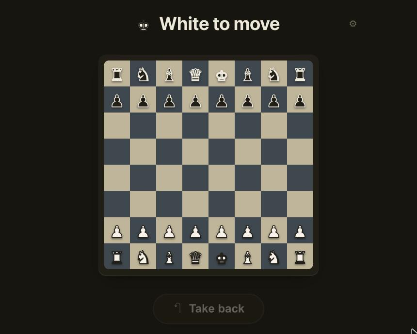

# ♟️ Chess For Dad

A calm, dead-simple chess board for two people to play together — for anyone who
finds chess.com busy and confusing. 🫶

One big high-contrast board, tap a piece to see its moves as fat dots, an
impossible-to-miss **Take back** button, and plain-language "*Name* to move." ✨
No clock, no accounts, no menus, no notation — and illegal moves simply can't be
made. ♜



## 🧠 One rules brain, no bugs

The move legality and game status come from **OmegaZero**, my C++ chess engine —
its move generator, extracted and stripped down to just the rules. Same logic,
one source of truth, verified with `perft`:

```
make                     # build the chess-for-dad rules brain
./chess-for-dad perft 4  # move-generation self-check
./chess-for-dad moves    # legal moves + game status for a position
```

## ▶️ Play

**Two devices, live** — one command:

```
./start.sh        # builds if needed, then prints a link for each device
```

Open the printed link on both devices (same Wi-Fi) and moves sync instantly. 📱↔️📱

**One device** (pass-and-play) works with no server at all — just open `index.html`
or the [live board](https://noah8368.github.io/chess-for-dad/).

Tap the gear ⚙️ to set names, which side faces you, and **You play: White / Black /
Both** — so each person only moves their own pieces (or add `?side=w` / `?side=b`
to the URL).

## 🌐 Play together, from anywhere

A copy runs 24/7 on a small always-on server, so two people can share one game
over the internet with zero setup on either device.

**Live game → http://159.69.32.163:8000**

- Open it on both devices — any network (home Wi-Fi, cellular, anywhere).
- Lock each device to one colour, so a person only ever moves their own pieces:
  - White → http://159.69.32.163:8000/?side=w
  - Black → http://159.69.32.163:8000/?side=b
- **Bookmark it, or "Add to Home Screen"**, so it's a one-tap icon with no URL to
  type — the whole point is that Dad can just tap and play. 📱
- You don't have to be online at the same time: the game lives on the server, so
  play live (moves appear instantly) *or* turn-by-turn — move now, come back
  later. Tap the gear ⚙️ to set names; they sync to both devices.

It runs as a `systemd` service, so it stays up across reboots and restarts itself
if it ever stops. To update after a code change:

```
ssh root@159.69.32.163 'cd /root/chess-for-dad && git pull && make && systemctl restart chess-for-dad'
```
